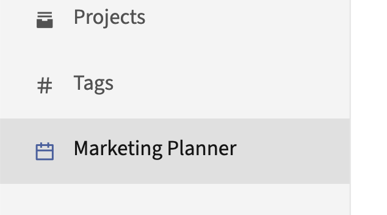

# MauticMarketingPlannerBundle

A shared marketing calendar plugin for Mautic. Plan and track marketing activities across your team with month, year and list views.

Created by [Dropsolid](https://dropsolid.com) · [Frederik Wouters](https://frederikwouters.be/)

---

## Screenshots




---

## Requirements

- Mautic 5.x / 7.x
- PHP 8.0+

---

## Installation

1. Copy the plugin into `docroot/plugins/MauticMarketingPlannerBundle/`
2. Clear the cache: `php bin/console cache:clear`
3. Install the plugin: `php bin/console mautic:plugins:install`
4. Run the bundled migration to create the table:

```bash
php bin/console doctrine:migrations:migrate --no-interaction
```

The migration is bundled inside the plugin (`Migration/Version20260601120000.php`) and is auto-registered via the bundle's DependencyInjection extension. It creates the `planner_items` table and respects the configured Mautic table prefix.

---

## Features

**Three views** - switch with the toolbar buttons:

| View | Description |
|---|---|
| List | All items sorted by deadline. Overdue dates highlighted red. |
| Month | Calendar grid (Mon-Sun). Items appear as chips on their deadline day. |
| Year | All 12 months, each listing that month's items. |

**Planning items** have:
- Name
- Description
- Deadline (the date shown in the calendar)
- Assigned to (any Mautic user)
- Done date (set via the done button or manually in the edit form)

**Done toggle** - one-click mark done/undo from the list and year views. Done items appear greyed out with a strikethrough in all views.

**Shared** - all logged-in users with the appropriate permission see and can manage all items.

**Permissions** - the plugin registers `plugin:marketingplanner:items` in Mautic's role system. Configure per role at Admin → Roles.

---

## Navigation

The planner is accessible via the calendar icon at the bottom of the left sidebar, or directly at `/s/planner`.

---

## Demo data

The migration inserts 14 sample planning items spread across June-August 2026 so the calendar is populated immediately after install.
